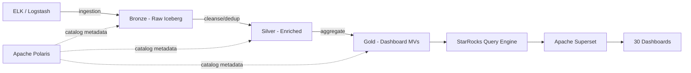

# ELK FMS → Data Lake Migration Plan

## Stack

| Component | Technology | Role |
|-----------|-----------|------|
| Storage | Object storage (S3/GCS/MinIO) | Parquet/ORC files for Iceberg tables |
| Catalog | **Apache Polaris** | Iceberg table catalog, namespace management, access control |
| Query Engine | **StarRocks** | SQL analytics, materialized views, dashboard queries |
| Architecture | **Medallion** (Bronze → Silver → Gold) | Data quality layers |

**How they connect**: Polaris manages Iceberg table metadata. StarRocks registers Polaris as an external Iceberg catalog and queries tables directly. StarRocks-native materialized views provide precomputed aggregations for dashboard performance.



## Overview

Migrate 33 Kibana dashboards and 28 Elasticsearch indices/transforms from ELK to the data lake.
Migration is ordered by **dependency priority** — nodes with the most dependents migrate first so
downstream consumers can be unblocked quickly.

**Total: 61 nodes, 82 edges, max chain depth: 5 levels**

---

## Medallion Architecture Mapping

### Bronze Layer (Raw Ingestion)

Raw ELK data landed as Iceberg tables with **no transformation**. Schema mirrors ES index mappings.
Partitioned by `created_at` (daily) for incremental ingestion.

| Polaris Namespace | Tables | Source |
|-------------------|--------|--------|
| `bronze.fms_mongodb` | `logstash_transaction`, `logstash_logon`, `logstash_hb_primary`, `logstash_hb_secondary`, `logstash_jpos` | MongoDB CDC (5 collections) |
| `bronze.fms_mysql` | `logstash_ticket_maintenance`, `logstash_ticket_implementation`, `logstash_pisa`, `logstash_ecrlink_enriched`, `logstash_paid_void_transaction`, `logstash_stock`, `logstash_ticket_with_upsert_heartbeat` | MySQL CDC (7 tables) |
| `bronze.fms_manual` | `target_edc_per_month_per_branch`, `population_historical_monthly` | Manual/periodic upload |
| `bronze.fms_derived` | `population_with_hb_trx_logon_ticket` | Pre-joined materialized (row 4 — 13 consumers, keep materialized) |

**Ingestion**: Airbyte CDC from MongoDB (5 collections) and MySQL (6 tables) → Iceberg tables in Polaris. Polaris manages table versions and partition evolution.

### Silver Layer (Cleaned, Enriched, Deduplicated)

Views or materialized views over Bronze that apply: deduplication, runtime field expansion, enrichment joins, type casting.
**No aggregations** — Silver stays at row-level granularity.

| # | Silver Object | Type | Depends On | Transformation |
|---|--------------|------|-----------|----------------|
| 5 | `silver.transaction_approved_paid_void` | MV (StarRocks) | bronze.logstash_transaction | Dedup by transaction_id, filter RC=00/approved/paid/void |
| 7 | `silver.first_trx_manual_key_in` | View | silver.transaction_approved_paid_void | First-transaction-per-terminal logic |
| 21 | `silver.latest_terminal_dismantle` | View | bronze.logstash_ticket_maintenance | ROW_NUMBER() dedup by serial_number, latest dismantle date |
| 36 | `silver.transaction_summary_by_tid` | View | bronze.logstash_transaction | ~25 runtime fields → CASE WHEN expressions |
| 43 | `silver.ticket_with_hb_trx_logon` | MV (StarRocks) | bronze.logstash_logon, hb_primary, hb_secondary | Join logon + heartbeat sources by terminal |
| 58 | `silver.transaction_access_point_feature` | MV (StarRocks) | bronze.logstash_transaction | Flatten nested filter aggs → GROUP BY poi, date, payment_category, features, status |
| — | `silver.population_enrichment_monthly` | MV (StarRocks) | bronze.logstash_transaction, logon, hb_primary, bronze.population_historical | **Collapsed enrichment** (replaces 6 ELK transforms, see Wave 3) |

**StarRocks MV strategy**: Materialize joins and expensive deduplication. StarRocks MVs auto-refresh on a schedule and serve as the stable Silver API.

### Gold Layer (Dashboard-Ready)

Pre-aggregated materialized views optimized for specific dashboard queries.
StarRocks-native MVs with Aggregate/Unique key models for sub-second dashboard response.

| # | Gold Object | Type | Source | Dashboard(s) |
|---|------------|------|--------|-------------|
| 23 | `gold.thermal_paper_consumption_daily` | MV | bronze.logstash_transaction | [22] Historical Thermal Paper |
| 51 | `gold.population_enrichment_monthly` | MV | silver.population_enrichment_monthly | [49] EDC Aktif Banjarmasin |
| — | `gold.trx_rc_daily_summary` | MV | silver.transaction_approved_paid_void | [15] Trx RC Short Timerange |
| — | `gold.ecr_monitoring_daily` | MV | bronze.logstash_ecrlink_enriched | [17] ECR Monitoring |
| — | `gold.void_transaction_daily` | MV | bronze.logstash_paid_void_transaction | [27] Void Monitoring |
| — | `gold.jpos_monitoring_daily` | MV | bronze.logstash_jpos | [31] JPOS Monitoring |
| — | `gold.signal_strength_by_poi` | MV | bronze.logstash_hb_primary, hb_secondary | [38] Signal Strength by POI |
| — | `gold.signal_strength_by_sn` | MV | bronze.logstash_hb_primary, hb_secondary | [41] Signal Strength by SN |
| — | `gold.pm_pending_summary` | MV | silver.ticket_with_hb_trx_logon | [42+44] PM Pending (merged) |
| — | `gold.app_version_distribution` | MV | silver.ticket_with_hb_trx_logon | [45] Operator & App Version |

**Dashboards that query Silver directly** (no Gold MV needed — low cardinality or point queries):
- [16] NOP EDC Terpasang → `bronze.population_with_hb_trx_logon_ticket`
- [33] Target KPI Overview → `bronze.target_edc_per_month_per_branch`
- [34] EDC NOP-v03 → `bronze.population_with_hb_trx_logon_ticket`
- [47] EDC Aktif-v01 → `bronze.population_with_hb_trx_logon_ticket`

### Polaris Catalog Structure

```
polaris/
├── bronze/
│   ├── fms_mongodb/      ← 5 MongoDB CDC Iceberg tables
│   ├── fms_mysql/        ← 7 MySQL CDC Iceberg tables
│   ├── fms_manual/       ← 2 static tables
│   └── fms_derived/      ← 1 materialized join (row 4)
├── silver/
│   └── fms/              ← 7 views/MVs (enriched, deduped, runtime fields expanded)
└── gold/
    └── fms/              ← ~10 MVs (dashboard-specific aggregations)
```

**Polaris benefits**:
- Namespace-level RBAC (Bronze = ETL writers, Silver/Gold = analysts + dashboards)
- Iceberg time-travel for rollback and data auditing
- Schema evolution tracking (add columns without breaking downstream)

### StarRocks Integration

```sql
-- Register Polaris as external Iceberg catalog in StarRocks
CREATE EXTERNAL CATALOG polaris_catalog
PROPERTIES (
    "type"     = "iceberg",
    "iceberg.catalog.type" = "rest",
    "iceberg.catalog.uri"  = "http://polaris-host:8181/api/catalog",
    "iceberg.catalog.credential" = "<client_id>:<client_secret>",
    "iceberg.catalog.warehouse"  = "fms"
);

-- Query Bronze directly
SELECT * FROM polaris_catalog.bronze.fms_mongodb.logstash_transaction LIMIT 10;

-- Create StarRocks-native MV for dashboard performance
CREATE MATERIALIZED VIEW gold.thermal_paper_consumption_daily
DISTRIBUTED BY HASH(mid)
REFRESH ASYNC START("2026-01-01 02:00:00") EVERY(INTERVAL 1 DAY)
AS
SELECT DATE(created_at) as date, mid,
       COUNT(*) as total_trx,
       SUM(CASE WHEN rc='00' THEN 1 ELSE 0 END) as success_trx
FROM polaris_catalog.bronze.fms_mongodb.logstash_transaction
GROUP BY DATE(created_at), mid;
```

**StarRocks model choice per layer**:
- Bronze queries: use StarRocks external catalog (no data duplication, queries Iceberg directly)
- Silver MVs: `AGGREGATE` model for rollups, `UNIQUE` model for dedup tables
- Gold MVs: `AGGREGATE` model with pre-aggregated metrics, partitioned by date

---

## Optimization Summary

Before migrating 1:1, the following optimizations reduce the number of materialized objects and simplify the pipeline.

### 1. Collapse the Enrichment Chain (4 transforms → 1 view)

Current ELK chain (4 separate ES transforms):

```
logstash-transaction  → [53] transaction_summary_by_poi (daily, by POI)
logstash-logon        → [54] logon_summary_by_poi       (daily, by POI)
logstash-hb_primary   → [55] hb_primary_summary_by_poi  (daily, by POI)
                           → [51] population_enrichment   (daily, by POI)
                              → [52] enrichment_prev_month (monthly, by POI)
                                 → [50] enrichment_per_month (monthly, by POI)
                                    → [49] Dashboard EDC Aktif Banjarmasin
```

**Data lake equivalent**: Single materialized view or scheduled SQL query that collapses rows 53, 54, 55, 51, 52, 50 into one. The daily rollups (53/54/55) become CTEs, the enrichment (51) becomes a JOIN with population master, and the monthly rollups (52/50) become GROUP BY POI, MONTH. **Eliminates 5 intermediate materialized objects.** This entire chain only feeds 1 dashboard (row 49).

### 2. Eliminate Single-Consumer Transforms (embed as views)

| Row | Transform | Replaced By |
|-----|-----------|-------------|
| 7 | transform-pivot-first_trx_manual_key_in | SQL view in dashboard [3] |
| 21 | transform-latest_terminal_dismantle | Window function (ROW_NUMBER dedup) in dashboard [20] |
| 53 | transform-pivot-transaction_summary_by_poi | CTE inside collapsed enrichment view |
| 54 | transform-pivot-logon_summary_by_poi | CTE inside collapsed enrichment view |
| 55 | transform-pivot-hb_primary_summary_by_poi | CTE inside collapsed enrichment view |
| 52 | transform-pivot-population_enrichment_prev_month | CTE inside collapsed enrichment view |
| 50 | transform-pivot-population_enrichment_per_month | Final output of collapsed enrichment view |

### 3. Move Runtime Fields to Query Time

ES transforms materialize runtime field scripts (CASE/WHEN logic). In a data lake, these are just SQL expressions.

- **Row 36** (transaction_summary_by_tid): ~25 runtime fields (`rd_group`, `response_code`, `error_source`, `status_group`, `is_timeout`, etc.) → computed as SQL `CASE WHEN` in a view, not materialized
- **Row 53** (transaction_summary_by_poi): `median_amount`, `q1_amount` lookup maps → SQL `CASE WHEN` in view
- **Row 52**: `trx_reliability` (last success within 7h) → SQL window function in view

### 4. Merge Duplicate Dashboards

| Rows | Dashboards | Action |
|------|-----------|--------|
| 57, 59 | Access Point Fitur FMS - Success TRX / Not Success TRX | Merge into 1 dashboard with success/not_success filter toggle |
| 13, 19 | Dashboard SIK & Dismantle-v02 (1) / (temp) | Merge into 1 dashboard (identical deps) |
| 42, 44 | Monitoring PM Pending - Visit / Target | Merge into 1 dashboard with time range selector |

**Net result: 33 dashboards → 30 dashboards.**

### 5. Row 4 (Population Join): Keep as Materialized View

`logstash-population_with_hb_trx_logon_ticket` (row 4) joins 3 source tables and has 13 consumers. In a data lake this is just a SQL JOIN, but keep it materialized for performance since it's the most-consumed node. Refresh daily with a simple join query — no complex ES ingest pipeline needed.

### 6. Row 58 (Access Point Feature): Simplify Aggregation Structure

ES transform has 3+ levels of nested filter aggregations per payment feature per category. In a data lake, use:
```sql
SELECT poi, date, payment_category, payment_features,
       CASE WHEN rc = '00' THEN 'success' ELSE 'not_success' END as status,
       COUNT(*) as count_trx, COUNT(DISTINCT acq_tid) as unique_tid
FROM logstash_transaction
GROUP BY poi, date, payment_category, payment_features, status
```
This replaces the entire nested filter agg tree with a single GROUP BY.

---

## Optimized Object Count

| Category | Before (ELK) | After (Data Lake) | Layer | Saved |
|----------|-------------|-------------------|-------|-------|
| Raw tables (Iceberg) | 15 logstash-* indices | 15 Iceberg tables | Bronze | 0 |
| Materialized views (enrichment) | 6 (enrichment chain) | 1 StarRocks MV | Silver | 5 |
| Materialized views (transforms) | 13 transforms | 7 StarRocks MVs/views | Silver | 6 |
| Gold MVs | — | ~10 dashboard-specific MVs | Gold | — |
| Dashboards | 33 | 30 | Query | 3 |
| **Total objects** | **61** | **~47** (across all layers) | — | **14** |

---

## Migration Waves (Optimized)

### Wave 1: Bronze Layer — Root Data Sources (No Dependencies)

Raw `logstash-*` indices ingested as Iceberg tables in Polaris namespaces `bronze.fms_mongodb` (5 MongoDB CDC collections) and `bronze.fms_mysql` (7 MySQL CDC tables).
This is the foundation — everything else depends on these tables existing.

| # | Index Name | Dependents | Notes |
|---|-----------|------------|-------|
| 6 | **logstash-transaction** | **14** | HIGHEST PRIORITY |
| 4 | **logstash-population_with_hb_trx_logon_ticket** | **13** | Materialized join of population + logon + heartbeat. Keep as MV in data lake. |
| 9 | logstash-ticket_maintenance-v02 | 7 | |
| 26 | logstash-logon | 6 | |
| 12 | logstash-ticket_implementation-v02 | 6 | |
| 39 | logstash-hb_primary | 5 | |
| 40 | logstash-hb_secondary | 3 | |
| 10 | logstash-pisa | 1 | |
| 18 | logstash-ecrlink_enriched | 1 | |
| 28 | logstash-paid_void_transaction | 1 | |
| 30 | logstash-stock-v03 | 1 | |
| 32 | logstash-jpos | 1 | |
| 46 | logstash-ticket_with_upsert_heartbeat | 1 | |
| 14 | target_edc_per_month_per_branch | 2 | Static target table |
| 2 | transform-population_historical_monthly | 2 | Feeds enrichment chain — treat as raw source |

**Action items:**
- [ ] Configure Polaris catalog: namespaces `bronze.fms_mongodb`, `bronze.fms_mysql`, `bronze.fms_manual`, `bronze.fms_derived`
- [ ] Register Polaris as external Iceberg catalog in StarRocks
- [ ] Create Iceberg tables for each index (map ES schema → Iceberg schema)
- [ ] Set up Airbyte connections: MongoDB source (5 collections) → Iceberg, MySQL source (6 tables) → Iceberg
- [ ] Partition Bronze tables by `created_at` (daily) for incremental writes
- [ ] Validate data completeness: row counts, field coverage, partition alignment

---

### Wave 2: Silver Layer — Transforms That Remain as Materialized Views

These transforms serve multiple consumers and warrant materialization as StarRocks MVs in the Silver layer.
All Silver objects live in Polaris namespace `silver.fms` or are StarRocks-native MVs querying Bronze Iceberg tables.

| # | Transform Name | Depends On | Consumers | DL Strategy (Silver Layer) |
|---|---------------|-----------|-----------|-------------|
| 5 | transform-transaction_approved_paid_void | [6] | [3,7] | StarRocks MV (UNIQUE key): dedup by transaction_id, filter RC=00/approved/paid/void |
| 23 | transform-transaction_summary_thermal_paper_consumption | [6] | [22] | Gold MV: daily agg by MID with filter-based counts |
| 36 | transform-transaction_summary_by_tid | [6] | [35] | StarRocks **view**: runtime fields → CASE WHEN at query time |
| 43 | logstash-ticket_with_hb_trx_logon | [26,39,40] | [42,44,45] | StarRocks MV (UNIQUE key): join of logon + heartbeat sources |
| 51 | transform-pivot-population_enrichment | [2,53,54,55] | [50,52] | **Collapse into**: StarRocks MV replacing 6 ELK transforms |
| 58 | transform-pivot-transaction_access_point_feature | [6] | [57,59] | StarRocks MV (AGGREGATE): GROUP BY poi, date, payment_category, features, status |

**Action items:**
- [ ] Convert ES transform JSON → StarRocks SQL (use Polaris catalog references for Bronze tables)
- [ ] Row 36: move 25 runtime field scripts to CASE WHEN in StarRocks view
- [ ] Row 51: collapse enrichment chain into single StarRocks MV (see Wave 3)
- [ ] Row 58: flatten nested filter aggs → AGGREGATE MV with GROUP BY
- [ ] Configure StarRocks MV refresh schedules (daily batch for most, hourly for row 5 if needed)
- [ ] Register all Silver MVs in Polaris namespace `silver.fms` for cross-engine discoverability

---

### Wave 3: Silver/Gold — Collapsed Enrichment View (replaces 6 ELK objects)

Replace the 4-level enrichment chain with a single StarRocks MV querying Bronze Iceberg tables via Polaris:

```sql
-- Silver layer: collapsed enrichment (replaces rows 53, 54, 55, 51, 52, 50)
CREATE MATERIALIZED VIEW silver.population_enrichment_monthly
DISTRIBUTED BY HASH(poi)
REFRESH ASYNC START("2026-01-01 03:00:00") EVERY(INTERVAL 1 DAY)
AS
WITH
  trx_summary AS (
    SELECT poi, DATE(created_at) as date,
           COUNT(*) as trx_count,
           SUM(CASE WHEN is_timeout THEN 1 ELSE 0 END) as timeout_count,
           COUNT(CASE WHEN rc='00' AND status IN ('paid','void') THEN 1 END) as success_count,
           ...
    FROM polaris_catalog.bronze.fms_mongodb.logstash_transaction
    GROUP BY poi, DATE(created_at)
  ),
  logon_summary AS (
    SELECT poi, DATE(created_at) as date, ...
    FROM polaris_catalog.bronze.fms_mongodb.logstash_logon
    GROUP BY poi, DATE(created_at)
  ),
  hb_summary AS (
    SELECT poi, DATE(created_at) as date, ...
    FROM polaris_catalog.bronze.fms_mongodb.logstash_hb_primary
    GROUP BY poi, DATE(created_at)
  ),
  daily_enriched AS (
    SELECT p.poi, t.date,
           t.trx_count, t.success_count, t.timeout_count, ...
           l.logon_count, l.logon_success_count, ...
           h.hbp_count, ...
           p.mid, p.tid, p.store_name, p.kanwil, ...
    FROM polaris_catalog.bronze.fms_derived.population_with_hb_trx_logon_ticket p
    LEFT JOIN trx_summary t ON p.poi = t.poi
    LEFT JOIN logon_summary l ON p.poi = l.poi AND t.date = l.date
    LEFT JOIN hb_summary h ON p.poi = h.poi AND t.date = h.date
  )
SELECT poi, DATE_TRUNC('month', date) as month,
       SUM(trx_count) as trx_total,
       SUM(success_count) as trx_success_total,
       ...  -- all 27 aggregation fields from row 50
FROM daily_enriched
WHERE date >= DATE_TRUNC('month', CURRENT_DATE - INTERVAL '1 month')
GROUP BY poi, DATE_TRUNC('month', date)
```

**ELK objects eliminated**: rows 53, 54, 55, 51, 52, 50 (6 transforms → 1 StarRocks MV)

---

### Wave 4: Gold Layer + Dashboard Migration (30 dashboards)

Dashboards query Gold MVs (pre-aggregated) or Silver views (row-level) via StarRocks.
All dashboards are leaf nodes — migrate last, after Bronze and Silver layers are validated.

**Batch 1: Population-only dashboards** (depend only on row 4 — migrate together once row 4 is ready)
- [16] Dashboard NOP EDC Terpasang
- [33] Target KPI Overview Q2
- [34] EDC NOP-v03
- [37] Signal Strength Overview-v03
- [47] EDC Aktif-v01
- [60] Population Heartbeat as Operator & App Version Distribution

**Batch 2: Ticket dashboards** (depend on rows 9,12 — migrate together)
- [11] Dismantle Status-v04
- [24] Ticket Performance-v09
- [13] Dashboard SIK & Dismantle-v02 (merge 13+19)
- [22] Historical Thermal Paper Used-v05
- [29] M3S BRI-v05

**Batch 3: Transaction dashboards** (depend on row 6 — migrate together)
- [15] Trx RC Short Timerange
- [17] ECR Monitoring-v02
- [25] Merchant Terdampak Timeout
- [56] EDC Timeout-BRI
- [48] Monitoring App Version v01
- [61] Transaction Response Short Timerange

**Batch 4: Signal/Heartbeat dashboards** (depend on rows 39,40)
- [38] Signal Strength Historical by POI
- [41] Signal Strength Historical by SN

**Batch 5: PM Monitoring dashboards** (depend on row 43 — merge 42+44)
- [42+44] Monitoring PM Pending (merged)
- [45] Operator & App Version Distribution

**Batch 6: Complex / multi-source dashboards** (migrate individually)
- [1] Historical Populasi FMS BRI (needs row 2)
- [3] Manual Key In Overview (needs rows 4,5,6,7 — row 7 becomes a view)
- [8] PISA-v02 (needs rows 9,10)
- [20] Population Growth (needs rows 4,21 — row 21 becomes a view)
- [27] Dashboard Void Monitoring (needs row 28)
- [31] JPOS Monitoring (needs rows 4,26,32)
- [35] Transaction Rate Summary (needs row 36 → SQL view)
- [49] EDC Aktif Kanwil Banjarmasin (needs collapsed enrichment view)
- [57+59] Access Point Fitur FMS (merged, needs row 58)

**Action items:**
- [ ] Export each Kibana dashboard JSON (Value column has Google Drive links)
- [ ] Create StarRocks Gold MVs for dashboards that need pre-aggregation
- [ ] Recreate dashboard in Apache Superset, connected to StarRocks
- [ ] Validate visual output matches ELK version (side-by-side comparison)
- [ ] Get sign-off from Helpdesk/BRI stakeholders
- [ ] Set up StarRocks query routing: dashboards → Gold MVs where available, Silver/Bronze otherwise

---

## Critical Path (Shortened)

After optimization, the longest chain is shortened because rows 53,54,55,52,50 are collapsed:

```
Bronze: logstash-transaction [6]
  → Silver: transform-transaction_approved_paid_void [5]  (StarRocks MV)
    → Silver: first_trx_manual_key_in [7]                  (StarRocks view)
      → Gold: [DBD] Manual Key In Overview [3]             (dashboard queries StarRocks)
```

```
Bronze: logstash-transaction [6] ─┐
Bronze: logstash-logon [26]       ├→ Silver: population_enrichment_monthly (1 StarRocks MV replaces 6 ES transforms)
Bronze: logstash-hb_primary [39]  ┘   → Gold: [DBD] EDC Aktif Banjarmasin [49]
Bronze: population_historical [2] ┘
```

---

## Schema Mapping Checklist (ES → Iceberg + StarRocks)

For each ES index, create an Iceberg table in Polaris and map types:

| ES Type | Iceberg Type | StarRocks Type | Notes |
|---------|-------------|----------------|-------|
| `text` + `keyword` | `STRING` | `VARCHAR` | Iceberg has no text/keyword distinction; full-text search not available |
| `date` | `TIMESTAMP` | `DATETIME` | Partition Bronze tables by this field (daily) |
| `long` | `LONG` | `BIGINT` | |
| `integer` | `INT` | `INT` | |
| `double` / `float` | `DOUBLE` / `FLOAT` | `DOUBLE` / `FLOAT` | |
| `boolean` | `BOOLEAN` | `BOOLEAN` | |
| `geo_point` | `STRUCT<lat DOUBLE, lon DOUBLE>` | `STRING` (WKT) or split columns | Flatten in Silver layer if needed for StarRocks |
| Nested `properties` | `STRUCT<...>` or `STRING` (JSON) | `VARCHAR` + `json_query` | Flatten frequently-queried nested fields in Silver |
| `ignore_above: 256` | — | `VARCHAR(256)` | StarRocks length constraint only |
| `runtime_mappings` | — | `CASE WHEN` in Silver view | Not materialized; computed at query time in StarRocks |

**Iceberg-specific checklist**:
- [ ] Define partition spec per table (`created_at` daily for time-series, none for static)
- [ ] Set sort order for common query patterns (e.g., `(poi, created_at)` for transaction table)
- [ ] Configure Iceberg compaction policies in Polaris (file size, delete file merge)
- [ ] Map ES `_id` → Iceberg natural key or StarRocks UNIQUE key for deduplication

---

## Validation Criteria

Each wave must pass before proceeding:

| Check | Layer | Method |
|-------|-------|--------|
| Row count match | Bronze | `SELECT COUNT(*)` from Iceberg table vs ES `_count` |
| Field completeness | Bronze | Compare null % per field between ES and Iceberg |
| Partition alignment | Bronze | Verify `created_at` partitions match ES index date ranges |
| Iceberg snapshot integrity | Bronze | `SELECT * FROM <table>.snapshots` — no orphaned files |
| Transform output match | Silver | Sample 1000 rows from StarRocks MV, compare with ES transform output |
| MV freshness | Silver/Gold | Verify StarRocks MV refresh completes within schedule window |
| StarRocks query plan | Silver/Gold | `EXPLAIN` key dashboard queries — confirm MV hits, no full Bronze scans |
| Dashboard parity | Gold | Side-by-side visual comparison with ELK dashboard |
| Performance | All | StarRocks query latency ≤ ELK equivalent (p95) |
| Polaris RBAC | All | Verify reader/writer roles cannot cross layer boundaries |

---

## Rollback Plan

- Keep ELK indices in read-only mode until all dashboards are verified in Superset
- **Iceberg time-travel**: Rollback any Bronze table to a known-good snapshot:
  ```sql
  CALL polaris.system.rollback_to_snapshot('bronze.fms_mongodb.logstash_transaction', <snapshot_id>)
  ```
- **StarRocks MV drop/recreate**: If a Silver/Gold MV produces incorrect results, drop and recreate from fixed SQL — no data loss since source is Bronze Iceberg
- Cutover only after all dashboards pass validation in Superset across all 3 layers
- ELK sunset after Superset validation complete — indices archived, cluster decommissioned
