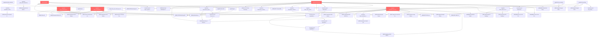

```mermaid
graph TD
    2["transform-population_histor..."] --> 1["[DBD] Historical Populasi F..."]
    2["transform-population_histor..."] --> 51["transform-pivot-population_..."]
    4["logstash-population_with_hb..."] --> 3["[DBD] Manual Key In Overvie..."]
    4["logstash-population_with_hb..."] --> 16["[DBD] Dashboard NOP EDC Ter..."]
    4["logstash-population_with_hb..."] --> 20["[DBD] Population Growth-v01"]
    4["logstash-population_with_hb..."] --> 21["transform-latest_terminal_d..."]
    4["logstash-population_with_hb..."] --> 29["[DBD] M3S BRI-v05"]
    4["logstash-population_with_hb..."] --> 31["[DBD] JPOS Monitoring-v01"]
    4["logstash-population_with_hb..."] --> 33["[DBD] Target KPI Overview Q..."]
    4["logstash-population_with_hb..."] --> 34["[DBD] EDC NOP-v03"]
    4["logstash-population_with_hb..."] --> 37["[DBD] Signal Strength Overv..."]
    4["logstash-population_with_hb..."] --> 47["[DBD] EDC Aktif-v01"]
    4["logstash-population_with_hb..."] --> 48["[DBD] Monitoring App Versio..."]
    4["logstash-population_with_hb..."] --> 49["[DBD] Dashboard EDC Aktif K..."]
    4["logstash-population_with_hb..."] --> 60["[DBD][BRI] Population Heart..."]
    5["transform-transaction_appro..."] --> 3["[DBD] Manual Key In Overvie..."]
    5["transform-transaction_appro..."] --> 7["transform-pivot-first_trx_m..."]
    6["logstash-transaction"] --> 3["[DBD] Manual Key In Overvie..."]
    6["logstash-transaction"] --> 5["transform-transaction_appro..."]
    6["logstash-transaction"] --> 15["[DBD] Trx RC Short Timerang..."]
    6["logstash-transaction"] --> 17["[DBD] ECR Monitoring-v02"]
    6["logstash-transaction"] --> 23["transform-transaction_summa..."]
    6["logstash-transaction"] --> 25["[DBD] Merchant Terdampak Ti..."]
    6["logstash-transaction"] --> 36["transform-transaction_summa..."]
    6["logstash-transaction"] --> 48["[DBD] Monitoring App Versio..."]
    6["logstash-transaction"] --> 53["transform-pivot-transaction..."]
    6["logstash-transaction"] --> 56["[DBD] EDC Timeout-BRI"]
    6["logstash-transaction"] --> 57["[DBD][BRI] Access Point Fit..."]
    6["logstash-transaction"] --> 58["transform-pivot-transaction..."]
    6["logstash-transaction"] --> 59["[DBD][BRI] Access Point Fit..."]
    6["logstash-transaction"] --> 61["[DBD][BRI] Transaction Resp..."]
    7["transform-pivot-first_trx_m..."] --> 3["[DBD] Manual Key In Overvie..."]
    26["logstash-logon"] --> 4["logstash-population_with_hb..."]
    26["logstash-logon"] --> 25["[DBD] Merchant Terdampak Ti..."]
    26["logstash-logon"] --> 31["[DBD] JPOS Monitoring-v01"]
    26["logstash-logon"] --> 43["logstash-ticket_with_hb_trx..."]
    26["logstash-logon"] --> 54["transform-pivot-logon_summa..."]
    26["logstash-logon"] --> 56["[DBD] EDC Timeout-BRI"]
    39["logstash-hb_primary"] --> 4["logstash-population_with_hb..."]
    39["logstash-hb_primary"] --> 38["[DBD] Signal Strength Histo..."]
    39["logstash-hb_primary"] --> 41["[DBD] Signal Strength Histo..."]
    39["logstash-hb_primary"] --> 43["logstash-ticket_with_hb_trx..."]
    39["logstash-hb_primary"] --> 55["transform-pivot-hb_primary_..."]
    40["logstash-hb_secondary"] --> 4["logstash-population_with_hb..."]
    40["logstash-hb_secondary"] --> 41["[DBD] Signal Strength Histo..."]
    40["logstash-hb_secondary"] --> 43["logstash-ticket_with_hb_trx..."]
    9["logstash-ticket_maintenance..."] --> 8["[DBD] PISA-v02"]
    9["logstash-ticket_maintenance..."] --> 11["[DBD] Dismantle Status-v04"]
    9["logstash-ticket_maintenance..."] --> 13["[DBD] Dashboard SIK & Disma..."]
    9["logstash-ticket_maintenance..."] --> 19["[DBD] Dashboard SIK & Disma..."]
    9["logstash-ticket_maintenance..."] --> 22["[DBD] Historical Thermal Pa..."]
    9["logstash-ticket_maintenance..."] --> 24["[DBD] Ticket Performance-v0..."]
    9["logstash-ticket_maintenance..."] --> 29["[DBD] M3S BRI-v05"]
    10["logstash-pisa"] --> 8["[DBD] PISA-v02"]
    12["logstash-ticket_implementat..."] --> 11["[DBD] Dismantle Status-v04"]
    12["logstash-ticket_implementat..."] --> 13["[DBD] Dashboard SIK & Disma..."]
    12["logstash-ticket_implementat..."] --> 19["[DBD] Dashboard SIK & Disma..."]
    12["logstash-ticket_implementat..."] --> 22["[DBD] Historical Thermal Pa..."]
    12["logstash-ticket_implementat..."] --> 24["[DBD] Ticket Performance-v0..."]
    12["logstash-ticket_implementat..."] --> 29["[DBD] M3S BRI-v05"]
    14["target_edc_per_month_per_br..."] --> 13["[DBD] Dashboard SIK & Disma..."]
    14["target_edc_per_month_per_br..."] --> 19["[DBD] Dashboard SIK & Disma..."]
    18["logstash-ecrlink_enriched"] --> 17["[DBD] ECR Monitoring-v02"]
    21["transform-latest_terminal_d..."] --> 20["[DBD] Population Growth-v01"]
    23["transform-transaction_summa..."] --> 22["[DBD] Historical Thermal Pa..."]
    28["logstash-paid_void_transaction"] --> 27["[DBD] Dashboard Void Monito..."]
    30["logstash-stock-v03"] --> 29["[DBD] M3S BRI-v05"]
    32["logstash-jpos"] --> 31["[DBD] JPOS Monitoring-v01"]
    36["transform-transaction_summa..."] --> 35["[DBD] Transaction Rate Summ..."]
    43["logstash-ticket_with_hb_trx..."] --> 42["[DBD] Monitoring PM Pending..."]
    43["logstash-ticket_with_hb_trx..."] --> 44["[DBD] Monitoring PM Pending..."]
    43["logstash-ticket_with_hb_trx..."] --> 45["[DBD] Operator & App Versio..."]
    46["logstash-ticket_with_upsert..."] --> 45["[DBD] Operator & App Versio..."]
    50["transform-pivot-population_..."] --> 49["[DBD] Dashboard EDC Aktif K..."]
    51["transform-pivot-population_..."] --> 50["transform-pivot-population_..."]
    51["transform-pivot-population_..."] --> 52["transform-pivot-population_..."]
    52["transform-pivot-population_..."] --> 50["transform-pivot-population_..."]
    53["transform-pivot-transaction..."] --> 51["transform-pivot-population_..."]
    54["transform-pivot-logon_summa..."] --> 51["transform-pivot-population_..."]
    55["transform-pivot-hb_primary_..."] --> 51["transform-pivot-population_..."]
    58["transform-pivot-transaction..."] --> 57["[DBD][BRI] Access Point Fit..."]
    58["transform-pivot-transaction..."] --> 59["[DBD][BRI] Access Point Fit..."]
    style 6 fill:#ff6b6b,stroke:#c0392b,color:#fff
    style 4 fill:#ff6b6b,stroke:#c0392b,color:#fff
    style 9 fill:#ff6b6b,stroke:#c0392b,color:#fff
    style 26 fill:#ff6b6b,stroke:#c0392b,color:#fff
    style 12 fill:#ff6b6b,stroke:#c0392b,color:#fff
```