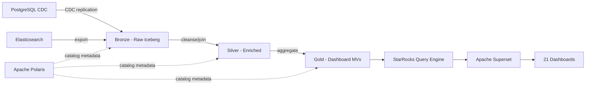

# ELK & PostgreSQL POSe → Data Lake Migration Plan

## Stack

| Component | Technology | Role |
|-----------|-----------|------|
| Storage | Object storage (S3/GCS/MinIO) | Parquet/ORC files for Iceberg tables |
| Catalog | **Apache Polaris** | Iceberg table catalog, namespace management, access control |
| Query Engine | **StarRocks** | SQL analytics, materialized views, dashboard queries |
| Architecture | **Medallion** (Bronze → Silver → Gold) | Data quality layers |

**How they connect**: Polaris manages Iceberg table metadata. StarRocks registers Polaris as an external Iceberg catalog and queries tables directly. StarRocks-native materialized views provide precomputed aggregations for dashboard performance.



## Overview

Migrate 21 Kibana dashboards, 15 Elasticsearch indices/transforms, and 43 PostgreSQL tables (CDC sources, transforms, views, staging) from ELK & PostgreSQL to the data lake.
Migration is ordered by **dependency priority** — nodes with the most dependents migrate first so downstream consumers can be unblocked quickly.

**Total: 79 nodes, 137 edges**

### Source Breakdown

| Type | Count | Source System |
|------|-------|--------------|
| Dashboard | 21 | Kibana |
| Index | 15 | Elasticsearch (5 cdc-pose-*, 4 transform-pivot-*, 2 logstash-*, 4 other) |
| Table | 43 | PostgreSQL (25 s_cdc_pose, 2 s_cdc_subscription, 1 s_cdc_mongopose, 5 s_staging, 8 s_transform_pose, 2 s_view) |

---

## Data Flow Architecture

The POSe pipeline follows a PostgreSQL-first pattern, unlike FMS which is ELK-first. Data flows through PostgreSQL stored procedures before being mirrored to Elasticsearch.

```
PostgreSQL CDC tables (25 s_cdc_pose + 2 s_cdc_subscription + 1 s_cdc_mongopose)
  ├── s_staging.* (5 staging/lookup tables)
  ├── s_view.* (2 dimension views)
  │
  ├── s_transform_pose.transaction (#21)          ← joins 22 source tables
  │     └── s_transform_pose.transaction_summary (#20)
  │           └── s_transform_pose.pose_pop_trx_sum_hist (#4)  ← joins with population_hist
  │                 └── cdc-pose-pose_pop_trx_sum_hist (ES)    ← 12 consumers
  │
  ├── s_transform_pose.pose_population_hist (#5)  ← joins 14 source tables
  │     └── cdc-pose-dm_thermal_pose (ES)
  │
  ├── s_transform_pose.population_v2 (#38)        ← joins 11 source tables
  │     └── cdc-pose-population_v2 (ES)           ← 6 consumers
  │
  ├── s_transform_pose.item_purchased (#53)       ← joins 23 source tables
  │     └── cdc-pose-item_purchased (ES)          ← 7 consumers
  │
  ├── s_transform_pose.dm_thermal_pose (#44)
  ├── s_transform_pose.tfm_visit_form_pose_meri_enriched (#65)
  │
  └── Kibana Dashboards (21 total)
```

---

## Medallion Architecture Mapping

### Bronze Layer (Raw Ingestion)

Raw PostgreSQL CDC data and Elasticsearch indices landed as Iceberg tables with **no transformation**.
Partitioned by date fields for incremental ingestion.

| Polaris Namespace | Tables | Source |
|-------------------|--------|--------|
| `bronze.pose_postgres` | `terminals`, `terminal_types`, `stores`, `merchants`, `clients`, `users`, `roles`, `companies`, `store_payment_methods`, `region_offices`, `transactions`, `orders`, `order_details`, `order_methods`, `qr_statics`, `items`, `categories`, `transaction_details`, `payment_methods`, `absence_logs`, `master_categories`, `stock_variants`, `options`, `variants`, `order_option_selecteds` | s_cdc_pose.* (25 tables) |
| `bronze.subscription_postgres` | `users`, `package_subs` | s_cdc_subscription.* (2 tables) |
| `bronze.pose_mongodb` | `thermal_activities` | s_cdc_mongopose.* (1 table) |
| `bronze.pose_staging` | `stg_dim_store_mapping_pose`, `stg_exp_pose_qrset`, `stg_data_populasi_pose_dismantle`, `stg_visit_form_pose_meri`, `stg_merchant_leads` | s_staging.* (5 tables) |
| `bronze.pose_views` | `dim_date`, `pose_subs_log` | s_view.* (2 tables) |
| `bronze.pose_elk` | `logstash_transaction_pose`, `logstash_population_pose` | ELK-native logstash indices only (2). CDC mirrors (cdc-pose-*) and transform-pivot-* are **not ingested** — redundant copies of PG transform tables. |

**Ingestion strategy**:
- **PostgreSQL CDC tables** (25 s_cdc_pose + 2 s_cdc_subscription) → Airbyte PostgreSQL source → Iceberg
- **MongoDB CDC** (s_cdc_mongopose.thermal_activities) → Airbyte MongoDB source → Iceberg
- **Staging tables** → Airbyte or manual refresh → Iceberg
- **Views** (dim_date, pose_subs_log) → Airbyte or scheduled SQL → Iceberg

### Silver Layer (Cleaned, Enriched, Deduplicated)

PostgreSQL transform logic reimplemented as StarRocks views or materialized views over Bronze tables.
**No aggregations** — Silver stays at row-level granularity.

| # | Silver Object | Type | Depends On | Transformation |
|---|--------------|------|-----------|----------------|
| 21 | `silver.transaction` | MV (StarRocks) | 22 bronze tables | Massive JOIN across s_cdc_pose + s_cdc_subscription + staging tables (replaces s_transform_pose.transaction) |
| 20 | `silver.transaction_summary` | View | silver.transaction | Daily aggregation of transactions (replaces s_transform_pose.transaction_summary) |
| 5 | `silver.pose_population_hist` | MV (StarRocks) | 14 bronze tables | Population history with store/terminal/merchant enrichment (replaces s_transform_pose.pose_population_hist) |
| 38 | `silver.population_v2` | MV (StarRocks) | 11 bronze tables | Population v2 with subscription enrichment (replaces s_transform_pose.population_v2) |
| 53 | `silver.item_purchased` | MV (StarRocks) | 23 bronze tables | Item purchase details with full product/order enrichment (replaces s_transform_pose.item_purchased) |
| 44 | `silver.dm_thermal_pose` | View | bronze.pose_mongodb.thermal_activities | Thermal paper consumption (replaces s_transform_pose.dm_thermal_pose) |
| 65 | `silver.tfm_visit_form_pose_meri_enriched` | View | bronze.pose_staging | Visit form enrichment (replaces s_transform_pose.tfm_visit_form_pose_meri_enriched) |

**StarRocks MV strategy**: The heaviest transforms (#21 with 22 deps, #53 with 23 deps) become StarRocks MVs that precompute the expensive multi-table JOINs. Lighter transforms become views.

### Gold Layer (Dashboard-Ready)

Pre-aggregated materialized views optimized for specific dashboard queries.
StarRocks-native MVs with Aggregate/Unique key models for sub-second dashboard response.

| # | Gold Object | Type | Source | Dashboard(s) |
|---|------------|------|--------|-------------|
| 4 | `gold.pose_pop_trx_sum_hist` | MV | silver.pose_population_hist + silver.transaction_summary | [1, 34, 41, 46, 47, 49, 61, 62, 77] — 9 dashboards |
| 37 | `gold.population_v2` | View | silver.population_v2 | [35, 47, 49, 50, 61, 78] — 6 dashboards |
| 36 | `gold.transaction` | View | silver.transaction | [35, 51, 59, 60, 61, 62, 69, 70, 74, 76, 77, 78] — 12 dashboards |
| 52 | `gold.item_purchased` | View | silver.item_purchased | [51, 59, 60, 69, 70, 73, 76] — 7 dashboards |
| 2 | `gold.population_enrichment_per_merchant` | MV | silver.pose_pop_trx_sum_hist | [1, 34, 47, 49] — 4 dashboards |
| 48 | `gold.population_enrichment_per_terminal` | MV | silver.pose_pop_trx_sum_hist | [47, 49, 61] — 3 dashboards |
| 43 | `gold.dm_thermal_pose` | View | silver.dm_thermal_pose + silver.pose_population_hist | [42] — 1 dashboard |
| 64 | `gold.tfm_visit_form_pose_meri` | View | silver.tfm_visit_form_pose_meri_enriched | [63] — 1 dashboard |
| 68 | `gold.tfm_visit_form_pivot` | MV | gold.tfm_visit_form_pose_meri | [63] — 1 dashboard |
| 71 | `gold.transaction_pose` | View | bronze.pose_elk.logstash_transaction_pose | [70] — 1 dashboard |
| 72 | `gold.trx_item_purchased` | MV | gold.transaction_pose | [70] — 1 dashboard |
| 79 | `gold.population_enrichment_per_store` | MV | silver.pose_pop_trx_sum_hist | [78] — 1 dashboard |

**Dashboards that query Silver directly** (no Gold MV needed):
- [35] Dashboard Population POSe-v06 → silver.population_v2 + silver.transaction
- [62] TRX SUMMARY POSE QR SET → silver.transaction + silver.pose_pop_trx_sum_hist
- [74] TRX SUMMARY POSE MOBILE → silver.transaction

### Polaris Catalog Structure

```
polaris/
├── bronze/
│   ├── pose_cdc/          ← 25 s_cdc_pose Iceberg tables
│   ├── pose_subscription/ ← 2 s_cdc_subscription tables
│   ├── pose_mongopose/    ← 1 MongoDB CDC table
│   ├── pose_staging/      ← 5 staging tables
│   ├── pose_views/        ← 2 dimension views
│   └── pose_elk/          ← 2 logstash-* (ELK-native only)
├── silver/
│   └── pose/              ← 7 views/MVs (enriched, joined transforms)
└── gold/
    └── pose/              ← ~12 MVs (dashboard-specific aggregations)
```

### StarRocks Integration

```sql
-- Register Polaris as external Iceberg catalog in StarRocks
CREATE EXTERNAL CATALOG polaris_catalog
PROPERTIES (
    "type"     = "iceberg",
    "iceberg.catalog.type" = "rest",
    "iceberg.catalog.uri"  = "http://polaris-host:8181/api/catalog",
    "iceberg.catalog.credential" = "<client_id>:<client_secret>",
    "iceberg.catalog.warehouse"  = "pose"
);

-- Query Bronze CDC tables directly
SELECT * FROM polaris_catalog.bronze.pose_postgres.transactions LIMIT 10;

-- Create StarRocks MV for heavy multi-table JOINs
CREATE MATERIALIZED VIEW silver.transaction
DISTRIBUTED BY HASH(transaction_id)
REFRESH ASYNC START("2026-01-01 02:00:00") EVERY(INTERVAL 1 DAY)
AS
SELECT t.*, o.order_no, od.item_name, pm.payment_name, ...
FROM polaris_catalog.bronze.pose_postgres.transactions t
LEFT JOIN polaris_catalog.bronze.pose_postgres.orders o ON t.order_id = o.id
LEFT JOIN polaris_catalog.bronze.pose_postgres.order_details od ON o.id = od.order_id
LEFT JOIN polaris_catalog.bronze.pose_postgres.payment_methods pm ON t.payment_method_id = pm.id
... -- (22-table JOIN matching s_transform_pose.transaction)
```

**StarRocks model choice per layer**:
- Bronze queries: use StarRocks external catalog (no data duplication, queries Iceberg directly)
- Silver MVs: `UNIQUE` model for transform tables with deduplication (transaction, population_hist, item_purchased)
- Silver views: for lightweight transforms (dm_thermal_pose, tfm_visit_form, transaction_summary)
- Gold MVs: `AGGREGATE` model with pre-aggregated metrics, partitioned by date

---

## Optimization Summary

### 1. Collapse PostgreSQL Procedures into StarRocks MVs

PostgreSQL stored procedures are not needed in the data lake. Their logic (multi-table JOINs, aggregations, upserts) becomes StarRocks MV definitions.

| Procedure | Replaced By |
|-----------|-------------|
| s_transform_pose.transaction (22-table JOIN) | `silver.transaction` StarRocks MV |
| s_transform_pose.item_purchased (23-table JOIN) | `silver.item_purchased` StarRocks MV |
| s_transform_pose.pose_population_hist (14-table JOIN) | `silver.pose_population_hist` StarRocks MV |
| s_transform_pose.population_v2 (11-table JOIN) | `silver.population_v2` StarRocks MV |

### 2. Eliminate CDC Mirror Indices

ELK `cdc-pose-*` indices are just mirrors of PostgreSQL transform tables. In the data lake, dashboards query StarRocks directly — no need for an intermediate ES mirror.

| ELK Index | Replaced By |
|-----------|-------------|
| cdc-pose-pose_pop_trx_sum_hist | `gold.pose_pop_trx_sum_hist` StarRocks MV |
| cdc-pose-transaction | `gold.transaction` StarRocks view |
| cdc-pose-population_v2 | `gold.population_v2` StarRocks view |
| cdc-pose-item_purchased | `gold.item_purchased` StarRocks view |
| cdc-pose-dm_thermal_pose | `gold.dm_thermal_pose` StarRocks view |

### 3. Move Transform Pivot Logic to StarRocks MVs

ELK `transform-pivot-*` indices are ES transform aggregations. In the data lake, these become StarRocks MVs with SQL GROUP BY.

| ELK Transform | Replaced By |
|--------------|-------------|
| transform-pivot-population_enrichment_per_merchant_per_month | `gold.population_enrichment_per_merchant` StarRocks MV |
| transform-pivot-population_enrichment_per_terminal_per_month | `gold.population_enrichment_per_terminal` StarRocks MV |
| transform-pivot-population_per_merchant | `gold.population_per_merchant` StarRocks MV |
| transform-pivot-population_enrichment_per_store_per_month | `gold.population_enrichment_per_store` StarRocks MV |
| transform-pivot_tfm_visit_form_pose_meri_enriched | `gold.tfm_visit_form_pivot` StarRocks MV |
| transform-trx_item_purchased | `gold.trx_item_purchased` StarRocks MV |
| transform-latest_subscription | `gold.latest_subscription` StarRocks MV |
| transform-stock_mentor_meri-v04 | `gold.stock_mentor_meri` StarRocks MV |

### 4. Merge Dashboards with Identical Dependencies

| Rows | Dashboards | Action |
|------|-----------|--------|
| 51, 59, 60, 69, 76 | POSe Internal PCS-Trans Padang / Agrowisata / BPTD / Ancol / POSe Internal PCS | All depend on [36, 52] — merge into 1 dashboard with location filter |
| 62, 74 | TRX SUMMARY POSE QR SET / MOBILE | Both depend on transaction + population — merge with product_type filter |

**Net result: 21 dashboards → 17 dashboards.**

### 5. Staging Tables as Bronze Views

`s_staging.*` tables are often manually maintained lookup/mapping tables. In the data lake:
- If sourced from external systems → ingest as Bronze Iceberg tables
- If derived from CDC tables → reimplement as Silver views

---

## Optimized Object Count

| Category | Before (ELK+PG) | After (Data Lake) | Layer | Saved |
|----------|-----------------|-------------------|-------|-------|
| CDC source tables | 28 (s_cdc_*) | 28 Iceberg tables | Bronze | 0 |
| Staging tables | 5 (s_staging) | 5 Iceberg tables | Bronze | 0 |
| View/dimension tables | 2 (s_view) | 2 Iceberg tables | Bronze | 0 |
| Transform tables | 8 (s_transform_pose) | 7 StarRocks MVs/views | Silver | 1 |
| ELK CDC mirrors | 10 (cdc-pose-*, transform-*) | 0 (not ingested) | — | 10 |
| Logstash indices | 2 | 2 Iceberg tables | Bronze | 0 |
| Gold MVs | — | ~12 dashboard-specific MVs | Gold | — |
| Dashboards | 21 | 17 | Query | 4 |
| **Total objects** | **79** | **~60** (across all layers) | — | **19** |

---

## Migration Waves

### Wave 1: Bronze Layer — CDC Source Tables (No Dependencies)

All 28 PostgreSQL CDC tables ingested as Iceberg tables in Polaris namespace `bronze.pose_postgres`.
These are the foundation — everything else depends on these tables existing.

| # | Table Name | Dependents | Notes |
|---|-----------|------------|-------|
| 6 | **s_cdc_pose.terminals** | **4** | Terminal master data |
| 7 | s_cdc_pose.terminal_types | 3 | |
| 8 | **s_cdc_pose.stores** | **4** | Store master data |
| 9 | **s_cdc_pose.merchants** | **4** | Merchant master data |
| 10 | **s_cdc_pose.clients** | **4** | Client master data |
| 11 | s_cdc_pose.users | 3 | |
| 12 | s_cdc_pose.roles | 3 | |
| 13 | s_cdc_pose.companies | 3 | |
| 14 | s_cdc_pose.store_payment_methods | 1 | |
| 16 | s_cdc_pose.region_offices | 2 | |
| 22 | **s_cdc_pose.transactions** | **2** | Core transaction data |
| 23 | s_cdc_pose.orders | 1 | |
| 24 | s_cdc_pose.order_details | 1 | |
| 25 | s_cdc_pose.order_methods | 1 | |
| 26 | s_cdc_pose.qr_statics | 1 | |
| 27 | s_cdc_pose.items | 1 | |
| 28 | s_cdc_pose.categories | 1 | |
| 29 | s_cdc_pose.transaction_details | 1 | |
| 30 | s_cdc_pose.payment_methods | 1 | |
| 39 | s_cdc_pose.absence_logs | 0 | |
| 54 | s_cdc_pose.master_categories | 1 | |
| 55 | s_cdc_pose.stock_variants | 1 | |
| 56 | s_cdc_pose.options | 1 | |
| 57 | s_cdc_pose.variants | 1 | |
| 58 | s_cdc_pose.order_option_selecteds | 1 | |
| 31 | s_cdc_subscription.users | 1 | |
| 33 | s_cdc_subscription.package_subs | 1 | |
| 45 | s_cdc_mongopose.thermal_activities | 1 | MongoDB source |

**Also ingest in Wave 1:**
- 5 staging tables (bronze.pose_staging)
- 2 view/dimension tables (bronze.pose_views)
- 2 ELK-native indices: logstash-transaction_pose, logstash-population_pose-v02

**Not ingested (CDC mirrors — dashboards query StarRocks directly):**
- cdc-pose-pose_pop_trx_sum_hist, cdc-pose-transaction, cdc-pose-population_v2, cdc-pose-item_purchased, cdc-pose-dm_thermal_pose, cdc-pose-tfm_visit_form_pose_meri_enriched
- All transform-pivot-* indices (4)

**Action items:**
- [ ] Configure Polaris catalog: namespaces `bronze.pose_postgres`, `bronze.subscription_postgres`, `bronze.pose_mongodb`, `bronze.pose_staging`, `bronze.pose_views`, `bronze.pose_elk`
- [ ] Register Polaris as external Iceberg catalog in StarRocks
- [ ] Create Iceberg tables for each PostgreSQL table (map PG schema → Iceberg schema)
- [ ] Set up Airbyte connections: PostgreSQL source (pose_cdc, pose_subscription) → Iceberg
- [ ] Set up Airbyte connection: MongoDB source (pose_mongopose) → Iceberg
- [ ] Partition time-series tables by date fields (daily) for incremental writes
- [ ] Validate data completeness: row counts, field coverage, partition alignment

---

### Wave 2: Silver Layer — Transform Tables as StarRocks MVs

Reimplement PostgreSQL transform table logic as StarRocks MVs querying Bronze Iceberg tables.
These are the most complex objects — they replace 22-23 table JOINs from PostgreSQL procedures.

| # | Transform Name | Depends On | Consumers | DL Strategy |
|---|---------------|-----------|-----------|-------------|
| 21 | **s_transform_pose.transaction** | 22 bronze tables | [20, 36] | StarRocks MV (UNIQUE key): massive multi-table JOIN |
| 5 | **s_transform_pose.pose_population_hist** | 14 bronze tables | [4, 43] | StarRocks MV (UNIQUE key): population enrichment |
| 38 | s_transform_pose.population_v2 | 11 bronze tables | [37, 50] | StarRocks MV (UNIQUE key): population v2 |
| 53 | **s_transform_pose.item_purchased** | 23 bronze tables | [52] | StarRocks MV (UNIQUE key): item purchase enrichment |
| 44 | s_transform_pose.dm_thermal_pose | 1 bronze table | [43] | StarRocks view (lightweight) |
| 65 | s_transform_pose.tfm_visit_form_pose_meri_enriched | 2 bronze tables | [68] | StarRocks view (lightweight) |

**Action items:**
- [ ] Convert PostgreSQL JOIN logic → StarRocks SQL (reference Bronze tables via Polaris catalog)
- [ ] Row 21: implement 22-table JOIN as StarRocks MV with UNIQUE key on transaction primary key
- [ ] Row 5: implement 14-table JOIN as StarRocks MV with UNIQUE key on terminal+date
- [ ] Row 53: implement 23-table JOIN as StarRocks MV with UNIQUE key on order detail primary key
- [ ] Configure StarRocks MV refresh schedules (daily batch for most)
- [ ] Register all Silver MVs in Polaris namespace `silver.pose`
- [ ] Validate transform output: sample 1000 rows from StarRocks MV, compare with PostgreSQL transform table

---

### Wave 3: Silver Layer — Summary & Aggregation Views

Lightweight views over Silver transform tables.

| # | Object | Type | Source | Consumers |
|---|--------|------|--------|-----------|
| 20 | `silver.transaction_summary` | View | silver.transaction | [4] |
| 4 | `silver.pose_pop_trx_sum_hist` | MV | silver.pose_population_hist + silver.transaction_summary | [2, 3, 43, 48, 79] |

**Action items:**
- [ ] Create `silver.transaction_summary` as StarRocks view (GROUP BY date, terminal)
- [ ] Create `silver.pose_pop_trx_sum_hist` as StarRocks MV joining population + transaction summary
- [ ] Validate aggregation output matches PostgreSQL transform results

---

### Wave 4: Gold Layer — Transform Pivot MVs + Dashboard Migration

ELK transform-pivot-* logic becomes Gold MVs. Dashboards are migrated last.

**Gold MVs (replace ELK transforms):**

| # | Gold Object | Source | Dashboard(s) |
|---|------------|--------|-------------|
| 2 | `gold.population_enrichment_per_merchant` | silver.pose_pop_trx_sum_hist | [1, 34, 47, 49] |
| 48 | `gold.population_enrichment_per_terminal` | silver.pose_pop_trx_sum_hist | [47, 49, 61] |
| 50 | `gold.population_per_merchant` | silver.population_v2 | [49] |
| 79 | `gold.population_enrichment_per_store` | silver.pose_pop_trx_sum_hist | [78] |
| 68 | `gold.tfm_visit_form_pivot` | silver.tfm_visit_form_pose_meri_enriched | [63] |
| 72 | `gold.trx_item_purchased` | bronze.pose_elk.logstash_transaction_pose | [70] |
| 40 | `gold.latest_subscription` | bronze.pose_elk.logstash_population_pose | [35] |
| 3 | `gold.stock_mentor_meri` | bronze.pose_elk.logstash_stock_mentor_details | [1]* |

**Dashboard migration batches:**

**Batch 1: Population dashboards** (depend on pose_pop_trx_sum_hist + population transforms)
- [1] Dashboard Population POSe QR Set - v01
- [34] Dashboard Population POSe Mobile-v11
- [47] Dashboard Client BRI Chain New Profiling - v01
- [49] Dashboard Client BRI Chain - v03
- [61] Dashboard Population PoV EDC - v02

**Batch 2: Transaction dashboards** (depend on cdc-pose-transaction)
- [35] Dashboard Population POSe-v06
- [51] POSe Internal PCS-Trans Padang
- [59] Dashboard Transaksi Agrowisata Gunung Mas Bogor
- [60] Dashboard Transaksi BPTD
- [62] TRX SUMMARY POSE QR SET
- [69] POSe Internal PCS-Ancol
- [70] POSe Internal PCS-Transmetro Pekanbaru
- [74] TRX SUMMARY POSE MOBILE
- [76] POSe Internal PCS
- [77] Dashboard UMKM Biro Perekonomian Jatim
- [78] Dashboard Monitoring Fest Kuliner Nusantara

**Batch 3: Specialized dashboards**
- [41] Dashboard Monitoring QR Inacash
- [42] Dashboard POSe QR-SET Thermal Paper
- [46] Dashboard POSe: Version & Simcard Monitoring
- [63] Dashboard Visit Form MERi POSe v01
- [73] Summary Product Sold Transpadang (15 menit)

**Action items:**
- [ ] Export each Kibana dashboard JSON
- [ ] Create StarRocks Gold MVs for transform-pivot-* replacements
- [ ] Recreate dashboards in Apache Superset, connected to StarRocks
- [ ] Validate visual output matches ELK version (side-by-side comparison)
- [ ] Get sign-off from stakeholders
- [ ] Set up StarRocks query routing: dashboards → Gold MVs where available, Silver/Bronze otherwise

---

## Critical Path

The longest dependency chain in POSe:

```
Bronze: s_cdc_pose.* (25 tables) ─┐
Bronze: s_cdc_subscription.* (2)  ├→ Silver: s_transform_pose.transaction (#21) [22-table JOIN]
Bronze: s_staging.* (5 tables)    ┘     → Silver: transaction_summary (#20)
Bronze: s_view.* (2 tables)       ┘           → Silver: pose_pop_trx_sum_hist (#4)
                                                      → Gold: population_enrichment_per_merchant (#2)
                                                          → Dashboard: [1, 34, 47, 49]
```

```
Bronze: s_cdc_pose.* (25 tables) ─┐
Bronze: s_cdc_subscription.* (2)  ├→ Silver: s_transform_pose.item_purchased (#53) [23-table JOIN]
Bronze: s_staging.* (5 tables)    ┘     → Gold: cdc-pose-item_purchased (#52)
Bronze: s_view.* (2 tables)       ┘           → Dashboard: [51, 59, 60, 69, 70, 73, 76]
```

---

## Schema Mapping (PostgreSQL → Iceberg + StarRocks)

| PG Type | Iceberg Type | StarRocks Type | Notes |
|---------|-------------|----------------|-------|
| `text` / `varchar` | `STRING` | `VARCHAR` | |
| `timestamptz` / `timestamp` | `TIMESTAMP` | `DATETIME` | Partition time-series tables by this field |
| `int8` / `bigint` | `LONG` | `BIGINT` | |
| `int4` / `integer` | `INT` | `INT` | |
| `int2` / `smallint` | `INT` | `SMALLINT` | |
| `float8` / `double` | `DOUBLE` | `DOUBLE` | |
| `boolean` | `BOOLEAN` | `BOOLEAN` | |
| `date` | `DATE` | `DATE` | |
| `json` / `jsonb` | `STRING` | `VARCHAR` + `json_query` | |
| `numeric` / `decimal` | `DECIMAL` | `DECIMAL` | |

**Iceberg-specific checklist**:
- [ ] Define partition spec per table (daily for transactions, none for master data)
- [ ] Set sort order for common query patterns (e.g., `(terminal_id, created_at)` for transaction table)
- [ ] Configure Iceberg compaction policies in Polaris
- [ ] Map PG primary keys → Iceberg natural keys or StarRocks UNIQUE keys for deduplication

---

## Validation Criteria

| Check | Layer | Method |
|-------|-------|--------|
| Row count match | Bronze | `SELECT COUNT(*)` from Iceberg table vs PostgreSQL source |
| Field completeness | Bronze | Compare null % per field between PG and Iceberg |
| Transform output match | Silver | Sample 1000 rows from StarRocks MV, compare with PostgreSQL transform table |
| MV freshness | Silver/Gold | Verify StarRocks MV refresh completes within schedule window |
| StarRocks query plan | Silver/Gold | `EXPLAIN` key dashboard queries — confirm MV hits, no full Bronze scans |
| Dashboard parity | Gold | Side-by-side visual comparison with Kibana dashboard |
| Performance | All | StarRocks query latency ≤ ELK equivalent (p95) |

---

## Rollback Plan

- Keep PostgreSQL and ELK in read-only mode until all dashboards are verified in Superset
- **Iceberg time-travel**: Rollback any Bronze table to a known-good snapshot
- **StarRocks MV drop/recreate**: If a Silver/Gold MV produces incorrect results, drop and recreate from fixed SQL
- Cutover only after all dashboards pass validation in Superset across all 3 layers
- ELK sunset after Superset validation complete — Kibana dashboards disabled, ES indices archived
