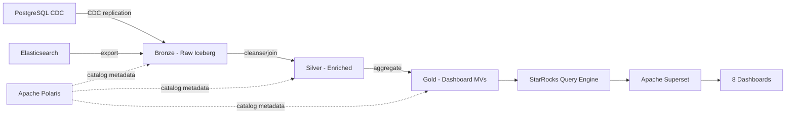

# ELK & PostgreSQL TAP (PCSDatahub) → Data Lake Migration Plan

## Stack

| Component | Technology | Role |
|-----------|-----------|------|
| Storage | Object storage (S3/GCS/MinIO) | Parquet/ORC files for Iceberg tables |
| Catalog | **Apache Polaris** | Iceberg table catalog, namespace management, access control |
| Query Engine | **StarRocks** | SQL analytics, materialized views, dashboard queries |
| Architecture | **Medallion** (Bronze → Silver → Gold) | Data quality layers |

**How they connect**: Polaris manages Iceberg table metadata. StarRocks registers Polaris as an external Iceberg catalog and queries tables directly. StarRocks-native materialized views provide precomputed aggregations for dashboard performance.



## Overview

Migrate 9 Kibana dashboards, 8 Elasticsearch indices/transforms, 29 PostgreSQL tables/views, and 16 MySQL CDC tables from ELK & PostgreSQL to the data lake.
Migration is ordered by **dependency priority** — nodes with the most dependents migrate first so downstream consumers can be unblocked quickly.

**Total: 46 nodes, 35 edges**

### Source Breakdown

| Type | Count | Source System |
|------|-------|--------------|
| Dashboard | 9 | Kibana (1 FMS-related, 8 TAP/POSe) |
| Index | 8 | Elasticsearch (3 cdc-*, 2 transform-*, 2 logstash-*, 1 other) |
| Table | 26 | PostgreSQL (12 s_cdc_tap, 5 s_cdc_subscription, 4 s_cdc_cl, 1 s_cdc_pose, 1 s_cdc_mongocl, 3 s_view, 1 s_staging) |
| View | 3 | PostgreSQL views |
| **MySQL CDC** | **19** | **Not in graph — additional Bronze sources: 15 picas.* tables (assets enrichment) + 4 mavis.* tables (stock_mentor_details)** |

---

## Data Flow Architecture

The TAP pipeline has two distinct sub-pipelines that share common CDC source tables.

### Sub-Pipeline 1: POSe Subscription Pipeline

```
s_cdc_tap.users (#57) ─────────────────────────────────┐
s_cdc_tap.submission_poses (#27) ──────────────────────┤
s_cdc_tap.districts (#42) ────────────────────────────┤
s_cdc_tap.regencies (#43) ────────────────────────────┤
s_cdc_tap.provinces (#44) ────────────────────────────┤
s_cdc_tap.ro_mavis (#39) ─────────────────────────────┤
s_cdc_tap.pose_subscriptions (#45) ───────────────────┤
s_view.pose_users_dummy (#9) ─────────────────────────┤
s_staging.stg_pengajuan_pose_qrset (#29) ─────────────┤
s_view.pose_subs_log (#40) ───────────────────────────┤
s_view.tap_users_sales (#41) ─────────────────────────┤
                                                      ▼
                    cdc-tap-submission_poses (ES #22)
                                                      ▼
                    Dashboard Monitoring TAP Marketing (#21)
                                                      ▼
                    cdc-tap-dm_pose_subscriptions (ES #6)  ← 8 consumers
                                                      ▼
                    Dashboards (#5, #10, #15, #17, #25, #26)
```

### Sub-Pipeline 2: Cashier Loyalty Pipeline

```
s_cdc_cl.users (#32) ──────────────────┐
s_cdc_cl.roles (#34) ──────────────────┤
s_cdc_cl.mid_employees (#35) ──────────┤
s_cdc_cl.attendances (#36) ────────────┤
s_cdc_mongocl.user_points (#37) ───────┤
s_cdc_subscription.users (#33) ────────┤
s_view.dim_date (#38) ─────────────────┤
                                       ▼
    cdc-internal-dm_cashloy_daily_point (ES #12)
                                       ▼
    Dashboard Point Cashier Loyalty (#11)
```

### Sub-Pipeline 3: Stock Mentor (FMS shared)

```
logstash-stock_mentor_details (ES #4)
                                       ▼
    transform-stock_mentor_meri-v04 (ES #3)
                                       ▼
    logstash-assets (ES #2)
                                       ▼
    [DBD] INVERA - Monitoring EDC FMS (#1)
```

---

## Medallion Architecture Mapping

### Bronze Layer (Raw Ingestion)

Raw PostgreSQL CDC data and Elasticsearch indices landed as Iceberg tables with **no transformation**.

| Polaris Namespace | Tables | Source |
|-------------------|--------|--------|
| `bronze.tap_postgres` | `users`, `submission_poses`, `companies`, `districts`, `regencies`, `provinces`, `pose_subscriptions`, `pose_subscription_histories`, `merchants`, `ro_mavis`, `model_has_roles`, `roles` | s_cdc_tap.* (12 tables) |
| `bronze.subscription_postgres` | `users`, `subs_detail_logs`, `package_services`, `subs_logs`, `package_subs` | s_cdc_subscription.* (5 tables) |
| `bronze.cl_postgres` | `users`, `roles`, `mid_employees`, `attendances` | s_cdc_cl.* (4 tables) |
| `bronze.pose_postgres` | `users` | s_cdc_pose.* (1 table) |
| `bronze.cl_mongodb` | `user_points` | s_cdc_mongocl.* (1 table) |
| `bronze.tap_staging` | `stg_pengajuan_pose_qrset` | s_staging.* (1 table) |
| `bronze.tap_views` | `dim_date`, `pose_subs_log`, `pose_users_dummy`, `tap_users_sales` | s_view.* (4 tables/views) |
| `bronze.picas_mysql` | `assets`, `catalogs`, `items`, `asset_sub_categories`, `conditions`, `asset_statuses`, `work_units`, `regions`, `teams`, `users`, `departments`, `asset_opname_results`, `asset_opname_result_statuses`, `asset_opname_regions`, `asset_opnames` | MySQL picas.* CDC (15 tables) |
| `bronze.mavis_mysql` | `inventories`, `inventory_types`, `sps`, `users` | MySQL mavis.* CDC (4 tables) |

**Ingestion strategy**:
- **PostgreSQL CDC tables** (s_cdc_tap, s_cdc_cl, s_cdc_subscription, s_cdc_pose) → Airbyte PostgreSQL source → Iceberg
- **MongoDB CDC** (s_cdc_mongocl.user_points) → Airbyte MongoDB source → Iceberg
- **MySQL CDC** (picas.* 15 tables for assets enrichment, mavis.* 4 tables for stock_mentor_details) → Airbyte MySQL source → Iceberg
- **PostgreSQL views** → Airbyte or scheduled SQL → Iceberg

### Silver Layer (Cleaned, Enriched, Deduplicated)

PostgreSQL stored procedure logic reimplemented as StarRocks MVs or views.
**Procedures are eliminated** — their multi-table JOIN + INSERT logic becomes StarRocks MV definitions.

| # | Silver Object | Type | Replaces | Transformation |
|---|--------------|------|----------|----------------|
| 22 | `silver.submission_poses` | MV (StarRocks) | ELK cdc-tap-submission_poses | Complex multi-table JOIN across 15+ tables (submission_poses + merchants + districts + regencies + provinces + users + pose_subscriptions + first_payment + recurring_payment + manager_ro + stg_pengajuan_pose_qrset) |
| 6 | `silver.dm_pose_subscriptions` | MV (StarRocks) | ELK cdc-tap-dm_pose_subscriptions | JOIN across 10+ tables (submission_poses + pose_subs_log + tap_users_sales + districts + regencies + provinces + manager_ro + pose_subscriptions + stg_pengajuan_pose_qrset) |
| 12 | `silver.dm_cashloy_daily_point` | MV (StarRocks) | ELK cdc-internal-dm_cashloy_daily_point | Cross-schema JOIN (cl.users + cl.roles + cl.mid_employees + cl.attendances + mongocl.user_points + subscription.users + dim_date) with window functions for cumulative sums |
| 9 | `silver.pose_users_dummy` | View | View #9 | Filter for dummy/test/sales users (simple WHERE clause) |
| 40 | `silver.pose_subs_log` | View | View #40 | Subscription log with payment history |
| 41 | `silver.tap_users_sales` | View | View #41 | Sales user hierarchy with leader/manager/head chain |
| 2 | `silver.assets` | MV (StarRocks) | ELK logstash-assets | 14-table JOIN across `bronze.picas_mysql.*` (assets + catalogs + items + asset_sub_categories + conditions + asset_statuses + work_units + regions + teams + users + departments + asset_opname_results + asset_opname_result_statuses + asset_opname_regions + asset_opnames). Filtered to EDC type. |
| 3 | `silver.stock_mentor_meri` | MV (StarRocks) | ELK transform-stock_mentor_meri | 4-table JOIN from `bronze.mavis_mysql.*` (inventories + inventory_types + sps + users) — GROUP BY region + technician, COUNT by serial number. Filters: status IN (PULL, PULLED, READY), no deleted_at, no sp_id. |

**StarRocks MV strategy**: All 5 ELK indices become StarRocks MVs. The original PostgreSQL procedures (now removed from the graph) contained complex INSERT ... ON CONFLICT logic (upserts) which maps directly to StarRocks UNIQUE key MVs.

### Gold Layer (Dashboard-Ready)

Pre-aggregated views optimized for specific dashboard queries.

| # | Gold Object | Type | Source | Dashboard(s) |
|---|------------|------|--------|-------------|
| 6 | `gold.dm_pose_subscriptions` | View | silver.dm_pose_subscriptions | [5, 10, 15, 17, 25, 26] — 6 dashboards |
| 16 | `gold.pose_all_subscription_per_sales` | MV | silver.dm_pose_subscriptions | [15, 25] — 2 dashboards |
| 18 | `gold.subscription_qrset_marketing` | View | silver.dm_pose_subscriptions | [17] — 1 dashboard |
| 22 | `gold.submission_poses` | View | silver.submission_poses | [21, 26] — 2 dashboards |
| 12 | `gold.dm_cashloy_daily_point` | View | silver.dm_cashloy_daily_point | [11] — 1 dashboard |
| 3 | `gold.stock_mentor_meri` | MV | silver.stock_mentor_meri | [1]* — 1 dashboard |
| 2 | `gold.logstash_assets` | View | silver.assets | [1]* — 1 dashboard |

### Polaris Catalog Structure

```
polaris/
├── bronze/
│   ├── tap_postgres/          ← 12 s_cdc_tap Iceberg tables
│   ├── subscription_postgres/ ← 5 s_cdc_subscription tables
│   ├── cl_postgres/           ← 4 s_cdc_cl tables
│   ├── pose_postgres/         ← 1 s_cdc_pose table
│   ├── cl_mongodb/            ← 1 s_cdc_mongocl table
│   ├── tap_staging/           ← 1 staging table
│   ├── tap_views/             ← 4 view/dimension tables
│   ├── picas_mysql/           ← 15 MySQL picas.* tables (assets enrichment)
│   └── mavis_mysql/           ← 4 MySQL mavis.* tables (inventories, inventory_types, sps, users)
├── silver/
│   └── tap/               ← 8 views/MVs (5 MVs + 3 views)
└── gold/
    └── tap/               ← ~7 MVs (dashboard-specific)
```

### StarRocks Integration

```sql
-- Register Polaris as external Iceberg catalog in StarRocks
CREATE EXTERNAL CATALOG polaris_catalog
PROPERTIES (
    "type"     = "iceberg",
    "iceberg.catalog.type" = "rest",
    "iceberg.catalog.uri"  = "http://polaris-host:8181/api/catalog",
    "iceberg.catalog.credential" = "<client_id>:<client_secret>",
    "iceberg.catalog.warehouse"  = "tap"
);

-- Silver: replaces ELK cdc-tap-submission_poses (originally populated by Procedure p_s_transform_tap_submission_poses)
CREATE MATERIALIZED VIEW silver.submission_poses
DISTRIBUTED BY HASH(submission_pose_id)
REFRESH ASYNC START("2026-01-01 02:00:00") EVERY(INTERVAL 1 DAY)
AS
WITH first_payment AS (
    SELECT DISTINCT ON (pose_subscription_id)
           pose_subscription_id, payment_method AS first_payment_method, ...
    FROM polaris_catalog.bronze.tap_views.pose_subs_log
    WHERE is_paid = 1 AND (is_first_time = 1 OR payment_method = 'MANUAL')
    ORDER BY pose_subscription_id, payment_date
),
recurring_payment AS (
    SELECT pose_subscription_id, SUM(price) AS total_recurring_payment, ...
    FROM polaris_catalog.bronze.tap_views.pose_subs_log
    WHERE is_paid = 1 AND is_first_time = 0 AND payment_method != 'MANUAL'
    GROUP BY pose_subscription_id
),
manager_ro AS (
    SELECT tu.id, tu.ro_mavis_id, trm.name AS manager_ro_name
    FROM polaris_catalog.bronze.tap_postgres.users tu
    JOIN polaris_catalog.bronze.tap_postgres.ro_mavis trm ON trm.id = tu.ro_mavis_id
)
SELECT tsp.id AS submission_pose_id, ...
FROM polaris_catalog.bronze.tap_postgres.submission_poses tsp
LEFT JOIN polaris_catalog.bronze.tap_postgres.merchants tm ON tm.id = tsp.merchant_id
LEFT JOIN polaris_catalog.bronze.tap_postgres.districts td ON td.id = tsp.district_id
LEFT JOIN polaris_catalog.bronze.tap_postgres.regencies tr2 ON tr2.id = tsp.regency_id
LEFT JOIN polaris_catalog.bronze.tap_postgres.provinces tp2 ON tp2.id = tr2.province_id
LEFT JOIN polaris_catalog.bronze.tap_views.tap_users_sales uf ON uf.id = tsp.user_id
LEFT JOIN polaris_catalog.bronze.tap_views.pose_subs_log ps ON ps.pose_subscription_id = tsp.pose_subscription_id
LEFT JOIN first_payment fp ON fp.pose_subscription_id = tsp.pose_subscription_id
LEFT JOIN recurring_payment rp ON rp.pose_subscription_id = tsp.pose_subscription_id
LEFT JOIN manager_ro ON manager_ro.id = uf.sales_manager_id;
```

**StarRocks model choice per layer**:
- Bronze queries: use StarRocks external catalog (no data duplication)
- Silver MVs: `UNIQUE` model for transform tables (submission_poses, dm_pose_subscriptions, dm_cashloy_daily_point)
- Silver views: for lightweight transforms (pose_users_dummy, pose_subs_log, tap_users_sales)
- Gold MVs: `AGGREGATE` model for pivot aggregations, `UNIQUE` for point queries

---

## Optimization Summary

### 1. Eliminate Stored Procedures (4 procedures → 0)

PostgreSQL stored procedures contain multi-table JOIN + INSERT ... ON CONFLICT logic. In the data lake, these become StarRocks MV definitions. The procedures are **not migrated** — their SQL logic is extracted and used as the MV AS clause. (Procedures and their DDL tables removed from dependency graph as non-data nodes.)

| Original Procedure | Replaced By | Complexity |
|-----------|-------------|------------|
| p_s_transform_tap_dm_pose_subscriptions | `silver.dm_pose_subscriptions` MV | 10-table JOIN with UNION ALL |
| p_s_transform_cashloy_daily_point | `silver.dm_cashloy_daily_point` MV | 8-table JOIN with window functions |
| p_s_transform_tap_dm_pose_subscriptions (v2) | merged into `silver.dm_pose_subscriptions` MV | Extended version unified with v1 |
| p_s_transform_tap_submission_poses | `silver.submission_poses` MV | 15-table JOIN with CTEs |

### 2. Eliminate CDC Mirror Indices

ELK `cdc-*` indices are mirrors of PostgreSQL transform tables. In the data lake, dashboards query StarRocks directly.

| ELK Index | Replaced By |
|-----------|-------------|
| cdc-tap-dm_pose_subscriptions (#6) | `gold.dm_pose_subscriptions` StarRocks view |
| cdc-tap-submission_poses (#22) | `gold.submission_poses` StarRocks view |
| cdc-internal-dm_cashloy_daily_point (#12) | `gold.dm_cashloy_daily_point` StarRocks view |

### 3. Move Transform Pivot Logic to StarRocks MVs

| ELK Transform | Replaced By |
|--------------|-------------|
| transform-pivot-pose_all_subscription_per_sales_per_month (#16) | `gold.pose_all_subscription_per_sales` StarRocks MV |
| transform-stock_mentor_meri-v04 (#3) | `gold.stock_mentor_meri` StarRocks MV |
| subscription_qrset_marketing (#18) | `gold.subscription_qrset_marketing` StarRocks view (from `silver.dm_pose_subscriptions`) |

### 4. Merge Dashboards with Identical Dependencies

| Rows | Dashboards | Action |
|------|-----------|--------|
| 5, 10, 15, 17, 25 | All depend on cdc-tap-dm_pose_subscriptions (#6) | Merge into 1 dashboard with filters (region, sales, time period) |

**Net result: 8 dashboards → 5 dashboards.**

### 5. PostgreSQL Views as StarRocks Views

`s_view.*` objects are database views. In the data lake, they become StarRocks views over Bronze tables.

| PG View | StarRocks View | Notes |
|---------|---------------|-------|
| s_view.pose_users_dummy (#9) | `silver.pose_users_dummy` | Simple filter view |
| s_view.pose_subs_log (#40) | `silver.pose_subs_log` | Subscription log aggregation |
| s_view.tap_users_sales (#41) | `silver.tap_users_sales` | Sales hierarchy view |
| s_view.dim_date (#38) | `silver.dim_date` | Date dimension (could be a shared utility) |

### 6. cron.* Tables Removed

`cron.job` and `cron.job_run_details` were PostgreSQL scheduling metadata used by procedures to determine incremental load windows. They have been removed from the dependency graph as non-data infrastructure nodes. In the data lake, StarRocks MV refresh schedules handle this automatically.

---

## Optimized Object Count

| Category | Before (ELK+PG) | After (Data Lake) | Layer | Saved |
|----------|-----------------|-------------------|-------|-------|
| PG CDC source tables | 23 (s_cdc_*) | 23 Iceberg tables | Bronze | 0 |
| MySQL CDC tables | 19 (picas.* 15 + mavis.* 4) | 19 Iceberg tables | Bronze | 0 |
| Staging tables | 1 (s_staging) | 1 Iceberg table | Bronze | 0 |
| View/dimension tables | 4 (s_view) | 4 StarRocks views | Silver | 0 |
| Stored procedures | 4 | 0 (eliminated) | — | 4 |
| Transform tables | 3 (s_transform_*) | 0 (logic absorbed into Silver MVs) | — | 3 |
| cron tables | 2 | 0 (removed — scheduling metadata) | — | 2 |
| ELK CDC mirrors | 6 (cdc-*, transform-*) | 0 (not ingested) | — | 6 |
| ELK-native logstash | 2 | 0 (replaced by MySQL CDC + Silver MVs) | — | 2 |
| Silver MVs | — | 5 (3 PG transforms + 2 MySQL enrichment) | Silver | — |
| Gold MVs/views | — | ~7 dashboard-specific | Gold | — |
| Dashboards | 9 | 5 | Query | 4 |
| **Total objects** | **46** + 16 MySQL | **~48** (across all layers) | — | — |

---

## Migration Waves

### Wave 1: Bronze Layer — CDC Source Tables (No Dependencies)

All 23 PostgreSQL CDC tables ingested as Iceberg tables.
Also ingest: 1 staging table, 2 logstash indices, 1 standalone ELK index.

| # | Table Name | Schema | Dependents | Notes |
|---|-----------|--------|------------|-------|
| 57 | **s_cdc_tap.users** | tap_cdc | **3** | Sales user hierarchy — critical for submission_poses |
| 27 | **s_cdc_tap.submission_poses** | tap_cdc | **5** | Core submission data — highest dependent count |
| 39 | s_cdc_tap.ro_mavis | tap_cdc | 3 | Regional office master |
| 42 | s_cdc_tap.districts | tap_cdc | 2 | Geographic reference |
| 43 | s_cdc_tap.regencies | tap_cdc | 2 | Geographic reference |
| 44 | s_cdc_tap.provinces | tap_cdc | 2 | Geographic reference |
| 45 | s_cdc_tap.pose_subscriptions | tap_cdc | 1 | |
| 46 | s_cdc_tap.merchants | tap_cdc | 1 | |
| 47 | s_cdc_tap.pose_subscription_histories | tap_cdc | 0 | |
| 54 | s_cdc_tap.companies | tap_cdc | 1 | |
| 55 | s_cdc_tap.model_has_roles | tap_cdc | 1 | |
| 56 | s_cdc_tap.roles | tap_cdc | 1 | |
| 32 | s_cdc_cl.users | tap_cl | 1 | |
| 33 | s_cdc_subscription.users | tap_subscription | 2 | |
| 34 | s_cdc_cl.roles | tap_cl | 1 | |
| 35 | s_cdc_cl.mid_employees | tap_cl | 1 | |
| 36 | s_cdc_cl.attendances | tap_cl | 1 | |
| 37 | s_cdc_mongocl.user_points | tap_mongocl | 1 | MongoDB source |
| 48 | s_cdc_subscription.subs_detail_logs | tap_subscription | 0 | |
| 49 | s_cdc_subscription.package_services | tap_subscription | 0 | |
| 50 | s_cdc_subscription.subs_logs | tap_subscription | 0 | |
| 51 | s_cdc_subscription.package_subs | tap_subscription | 0 | |
| 53 | s_cdc_pose.users | tap_pose | 0 | |

**Also ingest in Wave 1:**
- 1 staging table: s_staging.stg_pengajuan_pose_qrset (bronze.tap_staging)
- 15 MySQL picas tables: assets, catalogs, items, asset_sub_categories, conditions, asset_statuses, work_units, regions, teams, users, departments, asset_opname_results, asset_opname_result_statuses, asset_opname_regions, asset_opnames (bronze.picas_mysql)
- 4 MySQL mavis tables: inventories, inventory_types, sps, users (bronze.mavis_mysql)

**Not ingested (CDC mirrors — dashboards query StarRocks directly):**
- cdc-tap-dm_pose_subscriptions, cdc-tap-submission_poses, cdc-internal-dm_cashloy_daily_point
- subscription_qrset_marketing, transform-pivot-pose_all_subscription_per_sales_per_month

**Not migrated (removed from graph):**
- cron.job and cron.job_run_details — scheduling metadata only
- DDL tables (s_transform_tap.*, s_transform_internal.*) — transform table definitions
- Stored procedures — SQL logic extracted into Silver MVs

**Action items:**
- [ ] Configure Polaris catalog: namespaces `bronze.tap_postgres`, `bronze.subscription_postgres`, `bronze.cl_postgres`, `bronze.pose_postgres`, `bronze.cl_mongodb`, `bronze.tap_staging`, `bronze.tap_views`, `bronze.picas_mysql`, `bronze.mavis_mysql`
- [ ] Register Polaris as external Iceberg catalog in StarRocks
- [ ] Create Iceberg tables for each PostgreSQL table (map PG schema → Iceberg schema)
- [ ] Set up Airbyte connections: PostgreSQL source (tap_cdc, tap_cl, tap_subscription, tap_pose) → Iceberg
- [ ] Set up Airbyte connection: MongoDB source (tap_mongocl) → Iceberg
- [ ] Set up Airbyte connection: MySQL source (picas.* 15 tables → bronze.picas_mysql, mavis.* 4 tables → bronze.mavis_mysql)
- [ ] Validate data completeness: row counts, field coverage

---

### Wave 2: Silver Layer — Views (Lightweight Transforms)

PostgreSQL views reimplemented as StarRocks views over Bronze tables.

| # | View Name | Source | Notes |
|---|----------|--------|-------|
| 9 | `silver.pose_users_dummy` | bronze.tap_postgres.submission_poses + bronze.subscription_postgres.users | Filter for dummy/test/sales users |
| 40 | `silver.pose_subs_log` | bronze.tap_postgres.pose_subscription_histories + related tables | Subscription log with payment history |
| 41 | `silver.tap_users_sales` | bronze.tap_postgres.users + related tables | Sales user hierarchy |
| 38 | `silver.dim_date` | Standalone date dimension | Shared utility view |

**Action items:**
- [ ] Convert PostgreSQL view SQL → StarRocks view SQL (reference Bronze via Polaris catalog)
- [ ] Validate view output matches PostgreSQL view results

---

### Wave 3: Silver Layer — Transform MVs (Replaces ELK CDC Mirrors)

The ELK CDC mirror indices become StarRocks MVs. The original PostgreSQL procedures (removed from graph) provided the SQL logic.

| # | Silver Object | Replaces ELK Index | Depends On | Consumers |
|---|--------------|-------------------|-----------|-----------|
| 22 | **silver.submission_poses** | cdc-tap-submission_poses | 15+ bronze tables | [21, 26] |
| 6 | **silver.dm_pose_subscriptions** | cdc-tap-dm_pose_subscriptions | 10+ bronze tables | [5, 10, 15, 17, 25] |
| 12 | **silver.dm_cashloy_daily_point** | cdc-internal-dm_cashloy_daily_point | 8 bronze tables | [11] |

**Key implementation notes:**
- All 3 MVs use INSERT ... ON CONFLICT (upsert) logic → StarRocks UNIQUE key MVs
- Original procedures used incremental window logic (cron.job_run_details) → StarRocks MV refresh schedules handle this
- Procedure p_s_transform_tap_submission_poses has complex CTEs (first_payment, recurring_payment, manager_ro, stg_pose_qrset) → preserve as MV CTEs
- Original procedures #8 and #20 (dm_pose_subscriptions v1 and v2) can be unified into a single MV

**Action items:**
- [ ] Extract SQL from original procedure bodies (ignore PL/pgSQL control flow, keep only the SELECT/INSERT logic)
- [ ] Convert PostgreSQL-specific syntax → StarRocks SQL
- [ ] Implement as StarRocks MVs with UNIQUE key on primary key columns
- [ ] Configure daily refresh schedules
- [ ] Validate: compare 1000 rows from StarRocks MV vs PostgreSQL transform table
- [ ] Register in Polaris namespace `silver.tap`

---

### Wave 4: Gold Layer + Dashboard Migration

**Gold MVs (replace ELK indices):**

| # | Gold Object | Source | Dashboard(s) |
|---|------------|--------|-------------|
| 6 | `gold.dm_pose_subscriptions` | silver.dm_pose_subscriptions | [5, 10, 15, 17, 25, 26] |
| 16 | `gold.pose_all_subscription_per_sales` | silver.dm_pose_subscriptions (GROUP BY sales, month) | [15, 25] |
| 18 | `gold.subscription_qrset_marketing` | silver.dm_pose_subscriptions (filtered) | [17] |
| 22 | `gold.submission_poses` | silver.submission_poses | [21, 26] |
| 12 | `gold.dm_cashloy_daily_point` | silver.dm_cashloy_daily_point | [11] |
| 3 | `gold.stock_mentor_meri` | silver.stock_mentor_meri | [1] |
| 2 | `gold.logstash_assets` | silver.assets | [1] |

**Dashboard migration batches:**

**Batch 1: POSe Subscription dashboards** (all depend on #6)
- [5] Dashboard POSe Subscription
- [10] Dashboard POSe Revenue - v01
- [15] Dashboard POSe Revenue Regional Only - v01
- [17] Dashboard Reseller POSe Revenue
- [25] Dashboard POSe Revenue Digital Marketing - v01
- [26] TAP Sales POSe Mobile - v04

**Batch 2: Submission/Marketing dashboards** (depend on #22)
- [21] Dashboard Monitoring TAP Marketing - v01

**Batch 3: Cashier Loyalty dashboard** (depends on #12)
- [11] Dashboard Point Cashier Loyalty-v2

**Batch 4: FMS/Stock dashboard** (depends on #2, #3)
- [1] [DBD] INVERA - Monitoring EDC FMS v2

**Action items:**
- [ ] Export each Kibana dashboard JSON
- [ ] Create StarRocks Gold MVs for ELK transform replacements
- [ ] Recreate dashboards in Apache Superset, connected to StarRocks
- [ ] Validate visual output matches ELK version (side-by-side comparison)
- [ ] Get sign-off from stakeholders
- [ ] Set up StarRocks query routing: dashboards → Gold MVs where available, Silver/Bronze otherwise

---

## Critical Path

The longest dependency chain in TAP:

```
Bronze: s_cdc_tap.users (#57) ────────────────────────────┐
Bronze: s_cdc_tap.submission_poses (#27) ─────────────────┤
Bronze: s_cdc_tap.districts (#42) ────────────────────────┤
Bronze: s_cdc_tap.regencies (#43) ────────────────────────┤
Bronze: s_cdc_tap.provinces (#44) ────────────────────────┤
Bronze: s_cdc_tap.ro_mavis (#39) ─────────────────────────┤
Bronze: s_view.pose_subs_log (#40) ───────────────────────┤
Bronze: s_view.tap_users_sales (#41) ─────────────────────┤
Bronze: s_staging.stg_pengajuan_pose_qrset (#29) ─────────┤
                                                           ▼
                    Silver: submission_poses (#22) [15-table JOIN MV]
                                                           ▼
                    Silver: dm_pose_subscriptions (#6) [10-table JOIN MV]
                                                           ▼
                    Gold: dm_pose_subscriptions (#6)
                                                           ▼
                    Dashboards: [5, 10, 15, 17, 25, 26]
```

```
Bronze: s_cdc_cl.* (4 tables) ──────┐
Bronze: s_cdc_mongocl.user_points ──┤
Bronze: s_cdc_subscription.users ───┤
Bronze: s_view.dim_date (#38) ──────┤
                                     ▼
    Silver: dm_cashloy_daily_point (#12) [8-table JOIN MV with window functions]
                                     ▼
    Gold: dm_cashloy_daily_point (#12)
                                     ▼
    Dashboard: [11] Point Cashier Loyalty
```

---

## Schema Mapping (PostgreSQL → Iceberg + StarRocks)

| PG Type | Iceberg Type | StarRocks Type | Notes |
|---------|-------------|----------------|-------|
| `text` / `varchar` | `STRING` | `VARCHAR` | |
| `timestamptz` / `timestamp(6)` | `TIMESTAMP` | `DATETIME` | Partition time-series tables by this field |
| `int8` / `bigint` | `LONG` | `BIGINT` | |
| `int4` / `integer` | `INT` | `INT` | |
| `int2` / `smallint` | `INT` | `SMALLINT` | |
| `float8` / `double` | `DOUBLE` | `DOUBLE` | |
| `boolean` | `BOOLEAN` | `BOOLEAN` | |
| `date` | `DATE` | `DATE` | |
| `numeric` / `decimal` | `DECIMAL` | `DECIMAL` | |

**Iceberg-specific checklist**:
- [ ] Define partition spec per table (daily for transactions/submissions, none for master data)
- [ ] Set sort order for common query patterns
- [ ] Configure Iceberg compaction policies in Polaris
- [ ] Map PG primary keys → Iceberg natural keys or StarRocks UNIQUE keys

---

## Validation Criteria

| Check | Layer | Method |
|-------|-------|--------|
| Row count match | Bronze | `SELECT COUNT(*)` from Iceberg table vs PostgreSQL source |
| Field completeness | Bronze | Compare null % per field between PG and Iceberg |
| MV output match | Silver | Sample 1000 rows from StarRocks MV, compare with PostgreSQL transform table |
| MV freshness | Silver/Gold | Verify StarRocks MV refresh completes within schedule window |
| StarRocks query plan | Silver/Gold | `EXPLAIN` key dashboard queries — confirm MV hits, no full Bronze scans |
| Dashboard parity | Gold | Side-by-side visual comparison with Kibana dashboard |
| Performance | All | StarRocks query latency ≤ ELK equivalent (p95) |

---

## Rollback Plan

- Keep PostgreSQL and ELK in read-only mode until all dashboards are verified in Superset
- **Iceberg time-travel**: Rollback any Bronze table to a known-good snapshot
- **StarRocks MV drop/recreate**: If a Silver/Gold MV produces incorrect results, drop and recreate from fixed SQL
- Cutover only after all dashboards pass validation in Superset across all 3 layers
- ELK sunset after Superset validation complete — Kibana dashboards disabled, ES indices archived
